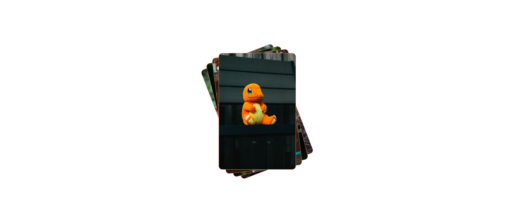

# HTML_CSS_Cards Stack Practice Project

This is a simple practice project demonstrating a stacked card layout using HTML and CSS. The project displays four images in card-style containers with overlapping rotations and interactive hover effects.

## Features

✅ Responsive flexbox-centered layout  
✅ Stacked cards with rotation and z-index ordering  
✅ Smooth image fitting inside cards  
✅ Hover effect to bring cards to the front  

## Project Structure

project/
│

    ├── index.html

    ├── style.css

    └── images/

        ├── image1.avif

        ├── image2.avif

        ├── image3.avif

        └── image4.avif

## How it Works

- The `#main` container uses flexbox to center the cards.  
- Each `.card` is absolutely positioned with a border and rounded corners, containing an image that is scaled using `object-fit: cover` to avoid stretching.  
- The cards are rotated at different angles and layered using `z-index`.  
- When you hover over a card, its `z-index` is increased to bring it to the top of the stack.

## Demo Preview

## How to Run

1. Clone or download this repository.  
2. Place your images inside the `images/` folder with the names `image1.avif` to `image4.avif`.  
3. Open `index.html` in your browser.

## Learning Highlights

- Flexbox centering (`align-items` and `justify-content`)  
- Absolute positioning and stacking with `z-index`  
- CSS `rotate` property  
- Image scaling with `object-fit`  
- CSS hover effects

## License

This project is for **practice purposes** only and does not use any copyrighted images.

---

Feel free to modify and improve the project as part of your CSS/HTML learning journey!
